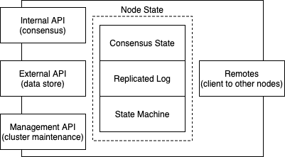
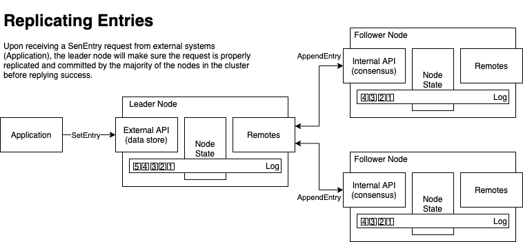

## Ackbox Raft

Partitioned data store implementation based on Raft consensus algorithm. This is a toy project and has never been used in production. I focused on providing a "simple" implementation for the Raft consensus algorithm. For that reason, the implementation was optimized for readability and not performance.  

Reference: https://raft.github.io/raft.pdf

### Supported Features
- Leader election and log replication.
- Durable persistence.
- Snapshot transfer and restore.
- Membership changes.
- Log compaction.
- Support for sharding / multiple partitions.

### Main Components

The following components provide the main functionality of the distributed data store:

- __Internal API__: GRPC backed API exposing the operations defined in the Raft paper (e.g. vote, append, snapshot). It's essentially the definition of the API allowing the consensus paper.
- __Management API__: GRPC backed API with cluster management operations (e.g. addNode and removeNode). The management API is supposed to be only available to actors who intend to manage the health of the cluster.
- __External API__: GRPC backed API exposing the data store operations (e.g. setEntry and getEntry). The external API is supposed to be only public interface/API of the data store.
- __Remotes__: Component encapsulating the logic of contacting other nodes in the cluster. In Raft, there's a lot of bookkeeping that nodes need to maintain about the state of other nodes in the cluster. This component provides a view on the remote node states as a result of previous interactions with them. In more concrete terms, this component keeps track of `nextIndex` and `matchIndex` of each node in the cluster.
- __Consensus State__: Component encapsulating all the state required by the Raft algorithm. That's where you will find the node's `currentTerm`, `votedFor`, `commitIndex` and `lastAppliedIndex` information.
- __Replicated Log__: Write ahead log that is replicated across the nodes in the cluster. Raft ensures that log items are consistently replicated to the nodes in the cluster. Here we provide an implementation of Raft log based on the idea of [Segmented Logs](https://martinfowler.com/articles/patterns-of-distributed-systems/log-segmentation.html). The segmented log idea coupled with the snapshot support makes log compaction a trivial process.
- __State Machine__: The replicated state machine per se in the Raft world. In this project, we provide a simple implementation for the state machine interface, which exposes the data store functionality. Every state machine command is in reality a command that is sent to our data store. Currently, we only support "set" and "get" but nothing prevents us from supporting more complex commands like "update" or "delete".

### Use Cases

#### Set Entry

The `SetEntry` is probably one of the simplest and most useful use cases to introduce Raft and the data store implemented in this project. Consider the following cluster composed of 3 nodes:

- An application (any external app actually) sends a `SetEntry` to the leader of the cluster.
- The leader of the cluster performs some checks according to the Raft protocol. If everything goes well, it writes the command to its local log.
- The leader then dispatches `AppendEntry` in parallel to all nodes in the cluster in order to replicate its own log changes.
- Upon receiving the `AppendEntry` request from the leader, the other nodes in the cluster (in the happy case all correctly setup as followers) compare and apply the leader changes to their own logs.
- Once the leader receives successful responses from the majority of the node in the cluster, it notifies the application that the entry was properly committed.

The use case explained above does not enter in details on what happens when there is a state drift between nodes or even when nodes temporarily don't on the leadership. These are very interesting use cases as well. Take a look at the implementation to learn more about how Raft primitives were implemented in this project.

### What's Next?

Take a look at `Raft` class if you want to learn more about the internals of the implementation. The `Raft` class is the entry point of the data store - it's where everything starts. There are a few examples in the `examples` package where you can have an idea on how start up a cluster and learn more about the consensus algorithm implementation.
